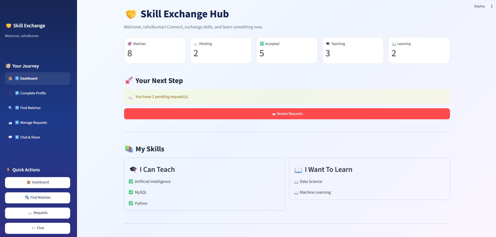
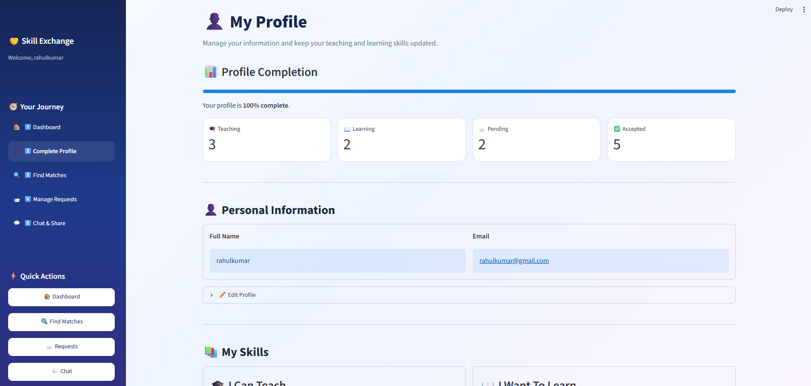
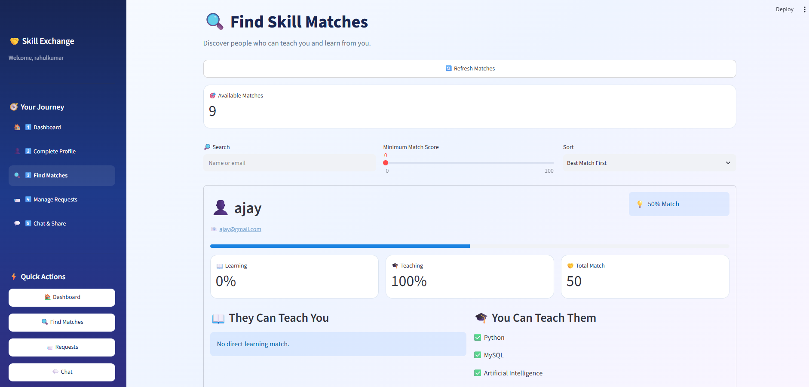
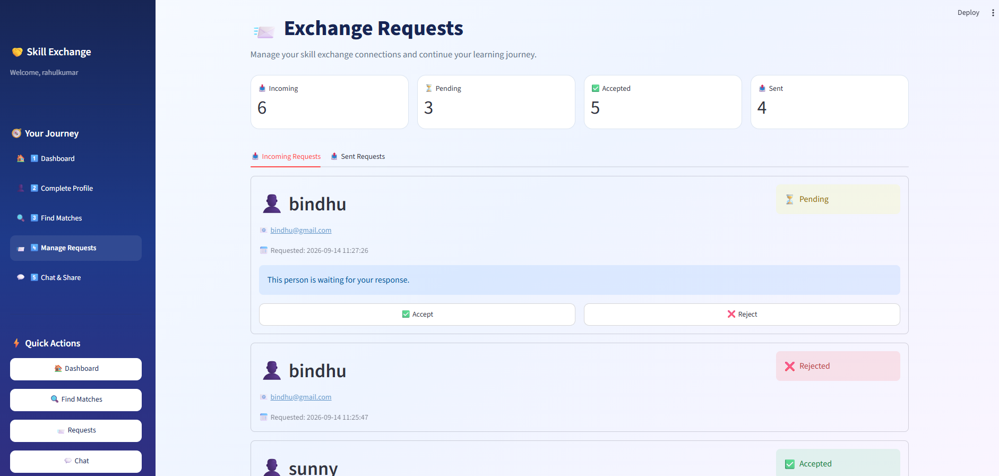
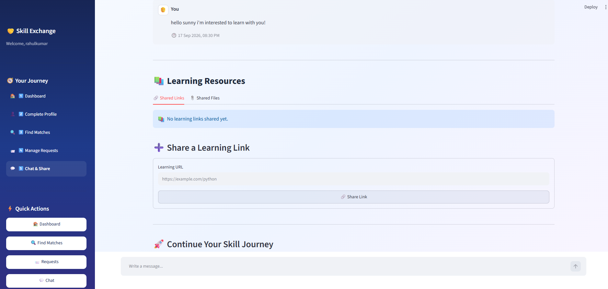

# 🤝 Skill Exchange Hub

Skill Exchange Hub is a web application that helps users connect with people who have complementary skills.

Users can create a profile, add the skills they can teach and want to learn, find matching users, send skill exchange requests, chat with accepted connections, and share learning resources.

## 🚀 Features

- User registration and login
- Secure password hashing with bcrypt
- User profile management
- Teaching and learning skill selection
- Skill-based user matching
- Match score calculation
- Send, accept, and reject exchange requests
- Real-time chat with automatic refresh
- Unread and read message tracking
- Active / last-active status
- Share learning links
- Share learning files
- File validation and 10 MB upload limit
- Common sidebar navigation
- Responsive Streamlit interface
- MySQL database integration

## 🛠️ Technologies Used

- Python
- Streamlit
- MySQL
- MySQL Connector/Python
- bcrypt
- Streamlit Autorefresh
- python-dotenv

## 📁 Project Structure

```text
SkillExchangeHub/
├── app.py
├── config.py
├── requirements.txt
├── .env.example
├── .gitignore
├── .streamlit/
│   └── config.toml
├── database/
│   └── connection.py
├── models/
│   ├── chat_model.py
│   ├── exchange_model.py
│   ├── match_model.py
│   ├── resource_model.py
│   ├── skill_model.py
│   └── user_model.py
├── pages/
│   ├── login.py
│   ├── register.py
│   ├── dashboard.py
│   ├── profile.py
│   ├── matches.py
│   ├── request.py
│   └── chat.py
├── utils/
│   └── ui.py
├── sql/
   └── schema.sql
## Screenshots

### Dashboard


### Profile


### Find Matches


### Exchange Requests


### Chat & Share

